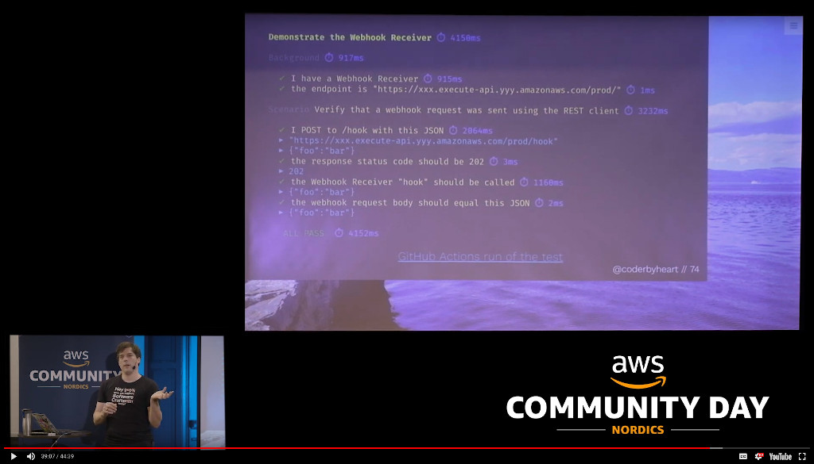

# End-to-end Behaviour Driven Design Test Runner 

Implementation of a test-runner for end-to-end tests of cloud-native
applications using [Gherkin features](https://docs.cucumber.io/gherkin/).

Initially developed for use with [AWS](https://aws.amazon.com/) based solutions
but also supports testing against generic REST, GraphQL, and Websocket APIs.

Simple example usage:
[e2e-bdd-test-runner-example](https://github.com/NordicSemiconductor/cloud-e2e-bdd-test-runner-example-js).

Other projects using this project for testing:

- nRF Asset Tracker
  - [AWS implementation](https://github.com/NordicSemiconductor/asset-tracker-cloud-aws-js)
  - [Azure implementation](https://github.com/NordicSemiconductor/asset-tracker-cloud-azure-js)
  - [Firmware](https://github.com/NordicSemiconductor/asset-tracker-cloud-firmware)
- [Distribute Aid: Flexport Shipment Monitor](https://github.com/distributeaid/flexport-shipment-monitor)
- [Distribute Aid: Twilio Integration](https://github.com/distributeaid/twilio-integration)
- Use with Phoenix (Elixir):
  [Masks for Docs: Toolbox](https://gitlab.com/masksfordocs/toolbox/-/commit/f98f05e2be3dadc23f6a4e6936a17b5ec293801d)

## Motivation

Building cloud-native solutions means leveraging the power of highly scalable,
often proprietary components, which can no longer be run locally on the
developer's machine. A critical part of the solution is also the configuration
which ties these components together.

End-to-end testing provides a way to ensure that the entire solution is working
properly and that changes not only in code and dependencies but also on the
provider side are catched immediately.

This project is an implementation of a test-runner in TypeScript that allows
every change to a cloud-native project to be tested tested against production
infrastructure using a BDD style test-suite of end-to-end tests written in
[Gherkin](https://cucumber.io/docs/gherkin/), which describe tests in plain
english.

This way the tests itself are not tied to the implementation and during
refactoring one cannot accidentally drop tests: tests written for test runners
like Jest tend to be tied closely to the API of the source-code implementation,
in a case of bigger refactoring the tests themselves usually need to be
refactored as well. Since the end-to-end tests are purely testing based on the
public API of the project, they can be kept unchanged during refactoring.

This also provides an easily grokable description of the working and implemented
projects features in one folder
([example](https://github.com/NordicSemiconductor/asset-tracker-cloud-aws-js/tree/saga/features)).

Below is a talk in English explaining this approach in detail:

[Video](https://youtu.be/yt7oJ-To4kI) ·
[Slides](https://coderbyheart.com/it-does-not-run-on-my-machine/)

## Installation

    npm i --save-dev @nordicsemiconductor/e2e-bdd-test-runner

## Special annotations

### On Features

- `@Skip`: Do not run this feature
- `@Only`: Run only this feature
- `@Last`: Run this feature after all others

### On Scenarios

- `@Retry`: configures the retry behaviour. Pass one or multiple settings to
  override the default behaviour. Example:
  `@Retry=failAfter:3,maxDelay:100,initialDelay:50`.

## Architecture decision records (ADRs)

see [./adr](./adr).
